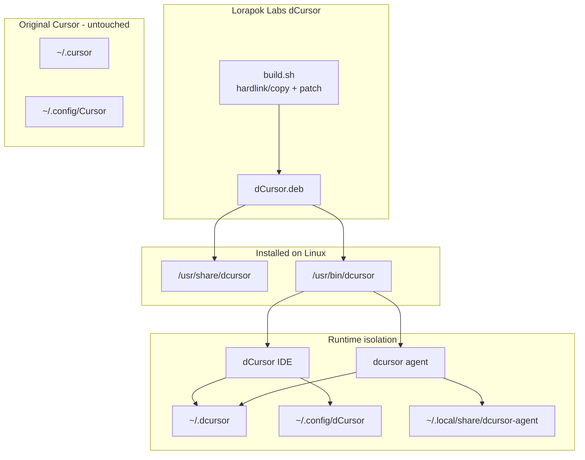

# dCursor

<p align="center">
  
</p>

<p align="center">
  <strong>A Lorapok Labs product — run two Cursor accounts on one Linux machine</strong>
</p>

<p align="center">
  <a href="https://github.com/Maijied/dCursor/releases/latest/download/dCursor.deb">
    
  </a>
  <a href="https://github.com/Maijied/dCursor/actions/workflows/build.yml">
    
  </a>
  <a href="https://github.com/Maijied/dCursor/releases">
    
  </a>
</p>

---

## What is dCursor?

**dCursor** stands for **duplicate Cursor** — a fully isolated mirror of the [Cursor](https://cursor.com) AI IDE, packaged as a standalone Debian app. It lets you run a **second Cursor instance** with its own account, extensions, agent, MCP servers, and settings — side by side with your original Cursor install.

Built by **[Lorapok Labs](https://github.com/Maijied)** as a developer productivity tool for multi-account workflows (work/personal, client projects, testing, etc.).

| | **Cursor** | **dCursor** |
|---|-----------|------------|
| **Command** | `cursor` | `dcursor` |
| **Config** | `~/.config/Cursor` | `~/.config/dCursor` |
| **Data** | `~/.cursor` | `~/.dcursor` |
| **Agent** | `~/.local/share/cursor-agent` | `~/.local/share/dcursor-agent` |
| **URL scheme** | `cursor://` | `dcursor://` |
| **Taskbar** | `Cursor` | `dCursor` |

Both apps can run **at the same time** with **different accounts**.

### Isolation from main Cursor

dCursor never writes to `~/.cursor` or `~/.config/Cursor`. The conversation import tool is read-only on Cursor paths.

| Concern | Behavior |
|---------|----------|
| **Agent data** | Isolated at `~/.local/share/dcursor-agent` (no hardlinks by default) |
| **`cursor://` handler** | Off by default; use `dcursor-url-handlers restore-cursor` if profile/auth breaks |
| **Seed agent from Cursor** | Opt-in only: `DCURSOR_SEED_AGENT_FROM_CURSOR=1 dcursor agent` |

Restore main Cursor as `cursor://` handler (recommended if profile/auth breaks):

```bash
dcursor-url-handlers restore-cursor
# or: xdg-mime default cursor-url-handler.desktop x-scheme-handler/cursor
```

Enable bridge only when dCursor GitHub OAuth needs it:

```bash
dcursor-url-handlers enable-bridge
```

---

## Download

### One-click install (recommended)

```bash
# Download latest .deb
wget -O dCursor.deb "https://github.com/Maijied/dCursor/releases/latest/download/dCursor.deb"

# Install
sudo dpkg -i dCursor.deb
sudo apt-get install -f -y
```

Or use the **[Download dCursor.deb](https://github.com/Maijied/dCursor/releases/latest/download/dCursor.deb)** button above.

### From a local build

```bash
git clone https://github.com/Maijied/dCursor.git
cd dCursor
./build.sh
sudo ./scripts/install.sh
```

---

## Quick start

```bash
dcursor              # Launch IDE (sign in with a separate account)
dcursor agent        # Launch isolated CLI agent
dcursor --version    # Check version
```

### Import conversations from Cursor

Copy chat history from main Cursor into dCursor. **Main Cursor is read-only** — dCursor never modifies `~/.cursor` or `~/.config/Cursor`.

**In the app:** Help → **Import Conversations from Cursor** (also in the status bar and Command Palette).

```bash
# Preview what would be imported
dcursor import-conversations --dry-run

# Close both Cursor and dCursor, then import
dcursor import-conversations
```

Aliases: `dcursor import-from-cursor`. A backup is saved under `~/.dcursor/backups/` before any changes.

Launch from your app menu: **dCursor** (Lorapok Larvae × Cursor hybrid icon).

---

## Architecture



### How it works

1. **Mirror** — Copies the installed Cursor app tree (`/usr/share/cursor` → `/usr/share/dcursor`) using hardlinks when possible for fast builds.
2. **Rebrand** — Patches `product.json` identity fields (`dataFolderName`, `urlProtocol`, `linuxIconName`, etc.) so dCursor uses separate paths.
3. **Isolate** — Custom launcher routes IDE and agent to `~/.dcursor` / `~/.config/dCursor` with `CURSOR_CONFIG_DIR` and `CURSOR_DATA_DIR`.
4. **Package** — Ships as a standalone `.deb` (~200 MB compressed) with desktop entry, AppArmor profile, and bash completion.

---

## Plans and roadmap

| Phase | Status | Description |
|-------|--------|-------------|
| **v1.0** | ✅ Done | Standalone amd64 `.deb`, full IDE + agent isolation |
| **v1.1** | 🔜 Planned | ARM64 build support |
| **v1.2** | 🔜 Planned | Auto-rebuild when Cursor updates (watch APT repo) |
| **v2.0** | 💡 Idea | Profile manager UI — switch between N Cursor mirrors |

---

## Build from source

### Requirements

- Cursor installed via `.deb`, **or** CI fetch script (no local Cursor needed)
- `python3`, `dpkg-deb`
- `rsvg-convert`, `inkscape`, or ImageMagick (icon export)
- `python3-pil` + `ffmpeg` or GStreamer (animated splash WEBM; required in strict/CI builds)

Install all build dependencies:

```bash
make deps
```

### Build

```bash
./build.sh
# or
make build
```

Strict build (fails if splash WEBM generation fails):

```bash
DCURSOR_STRICT_BUILD=1 ./build.sh
# or
make build-ci
```

Post-build audit (isolation + branding checks):

```bash
make audit DCURSOR_APP_ROOT=/tmp/dcursor-build/staging/usr/share/dcursor
```

### CI/CD (no local Cursor needed)

```bash
make deps
./scripts/ci-fetch-cursor.sh   # downloads latest Cursor .deb
DCURSOR_STRICT_BUILD=1 ./build.sh
```

GitHub Actions builds on every push/PR to `main` with full asset generation (Pillow + ffmpeg), runs `scripts/audit-isolation.sh`, and publishes artifacts to [Releases](https://github.com/Maijied/dCursor/releases).

### Build notes

- Staging uses `/tmp/dcursor-build.*` for valid `dpkg-deb` permissions (needed on NTFS/exFAT project drives).
- Hardlink copy (`cp -al`) is used when on the same filesystem as `/usr/share/cursor`; otherwise falls back to `cp -a`.
- Override: `DCURSOR_BUILD_DIR=/var/tmp/my-build ./build.sh`

---

## Updating

When Cursor updates on your system:

```bash
git pull
make build
sudo dpkg -i dist/dCursor.deb
```

Or download the latest CI-built package from [Releases](https://github.com/Maijied/dCursor/releases).

---

## Uninstall

```bash
sudo dpkg -r dcursor
```

This removes dCursor only. Your original Cursor install and both apps' user data remain untouched.

---

## Project structure

```
dCursor/
├── build.sh                    # Main build pipeline
├── config/identity.json        # Rebrand identity map
├── scripts/
│   ├── dcursor-launcher.sh     # IDE + agent launcher
│   ├── patch-product-json.py   # product.json patcher
│   ├── ci-fetch-cursor.sh      # CI: download Cursor .deb
│   └── install.sh              # Local install helper
├── assets/                     # Desktop, icon, AppArmor, mime
├── debian/                     # postinst, prerm, postrm
└── .github/workflows/build.yml # CI/CD auto-build + release
```

---

## Lorapok Labs

**dCursor** is a **[Lorapok Labs](https://github.com/Maijied)** open-source utility. The icon uses the Lorapok **Instar** larva identity — segmented cybernetic body, cyan (`#00F3FF`) / purple (`#BC13FE`) / neon green (`#39FF14`) palette — in a Cursor-style app tile. It marks this as your *second* Cursor instance.

- **Maintainer:** Maizied Hasan Majumder — Lorapok Labs
- **Repository:** [github.com/Maijied/dCursor](https://github.com/Maijied/dCursor)
- **Issues:** [github.com/Maijied/dCursor/issues](https://github.com/Maijied/dCursor/issues)

---

## License and disclaimer

Cursor is proprietary software by Anysphere. **dCursor** repackages an already-installed or officially downloaded Cursor copy for personal multi-account use on the same machine. You must comply with [Cursor's license](https://cursor.com/license.txt) for each account you sign in with.

The dCursor build tooling and branding assets in this repository are provided by Lorapok Labs as-is, without warranty.
